# ESP-Control-BLE Library — Audit Report

- **Date:** 2026-04-24
- **Scope:** `firmware/esp32/lib/esp-control-ble/`
- **Target hardware:** ESP32 classic (520 KB SRAM, no PSRAM)
- **Spec:** `docs/superpowers/specs/2026-04-24-esp-control-ble-audit-design.md`

## 1. Executive Summary

_Filled in last (Task 11)._

## 2. Methodology and Measurements

### 2.1 Tools

| Tool | Purpose | Command |
|---|---|---|
| `pio run -e esp32dev -v` | Linker/map output, section sizes | `tools/audit/pio_size_snapshot.ps1 -Label <name>` |
| `pio run -e esp32dev -t size` | Segment table (`.text`, `.rodata`, `.bss`, `.data`) | idem |
| `xtensa-esp32-elf-nm --size-sort` | Top symbols by memory footprint | idem |
| `pio test -e native -f test_audit_sizeof` | Hard `sizeof` numbers via `static_assert` | `pio test -e native -f test_audit_sizeof` |
| `tools/audit/count_smells.ps1` | Pattern tally (buffers, std::function, magic numbers, logging, bool returns) | `pwsh -File tools/audit/count_smells.ps1` |
| `esp_get_free_heap_size` / `uxTaskGetStackHighWaterMark` | Runtime heap and stack via probe firmware | See §2.3 |

### 2.2 Static measurement commands

Reproducible from repo root on Windows/PowerShell. If `pwsh` (PowerShell 7) is not
on PATH, substitute `powershell` (Windows PowerShell 5.1) — both work identically
for these scripts.

```powershell
# Full snapshot
pwsh -File tools/audit/pio_size_snapshot.ps1 -Label before-refactor

# Smells tally
pwsh -File tools/audit/count_smells.ps1 > .tmp/audit/smells.txt

# Sizeof assertions
cd firmware/esp32
pio test -e native -f test_audit_sizeof -v
```

### 2.3 Runtime measurement commands

Runtime numbers come from a probe firmware on branch `audit/probe-runtime`.
The branch is **discarded** after measurement — it is **NOT merged** into
`master` or into the audit branch.

**Probe checkpoints:**

| Checkpoint | API | Log prefix |
|---|---|---|
| Post-`setup()` | `esp_get_free_heap_size()` + `esp_get_minimum_free_heap_size()` | `[PROBE] post-setup` |
| Post-BLE connection | idem | `[PROBE] post-ble-connected` |
| Post-manifest send | idem | `[PROBE] post-manifest-sent` |
| Stack HWM (loop, every 5 s) | `uxTaskGetStackHighWaterMark(nullptr)` | `[PROBE] stack loop hwm` |
| Heap caps summary | `heap_caps_print_heap_info(MALLOC_CAP_8BIT)` | `[PROBE] heap_caps_8bit` |

User-facing procedure: `tools/audit/PROBE_INSTRUCTIONS.md`. The probe build
is prepared by Task 9 of the audit plan and consumed by Task 10.

### 2.4 Known measurement error and limitations

- **Probe overhead.** The instrumentation itself consumes RAM (`Serial.printf`
  format strings in `.rodata`, a few stack frames per probe, no `.bss`
  growth in the lib itself since the probe is in `app/main.cpp`). Pass 2
  records both a "probe-build" number and an estimated "clean-build" number.
  The estimate is computed by running `pio run -t size` on
  `audit/probe-runtime` and on `audit/esp-control-ble-lib` separately, then
  subtracting the segment deltas.
- **Single-device, single-session measurement.** Numbers come from one
  board running through one connection sequence. NimBLE's internal allocator
  fragments under repeated connect/disconnect cycles; expect ±200 B variance
  on heap numbers across re-runs.
- **Native-host `sizeof` vs target.** The native test (`test_audit_sizeof`)
  runs on the 32-bit-configured native host. POD types and pointer-bearing
  structs match the ESP32 target exactly — this was verified on first run by
  observing `sizeof(SubscriptionState) == 260` (matches ESP32 `64*4 + 4`,
  not the `64*4 + 8` a 64-bit host would produce). Discrepancies remain
  possible for unions or bitfields if introduced later.
- **`nm` symbol attribution.** Demangled names are matched to modules by
  namespace prefix. The library's headline symbol `(anonymous namespace)::control`
  has no namespace prefix because `app/main.cpp` declares its `EspControl`
  instance in an anonymous namespace; this is identified by manual inspection
  of `app/main.cpp` rather than by symbol name pattern.
- **PlatformIO "RAM" vs `.bss + .data`.** PlatformIO's reported "RAM" figure
  (42 124 B) is the **DRAM-resident portion** after the ESP-IDF linker
  resolves segment placement (some `.data` lives in flash on ESP32, read at
  boot via `memcpy`). The raw `.bss + .data = 139 949 B` from `pio run -t size`
  is therefore **not** the actual DRAM cost. The 42 124 B figure is the one
  to use for refactor target setting.

## 3. RAM Footprint

Pass 1 measurements: static analysis (`pio run -t size` segment totals,
`xtensa-esp32-elf-nm --size-sort` per-symbol attribution, native
`test_audit_sizeof` for verified `sizeof`). Pass 2 (runtime) populates §3.2-§3.3
once the user runs the probe firmware (Task 10).

### 3.1 Static `.bss` / `.data` per module

#### Whole-firmware totals

Source: `pio run -e esp32dev -t size` on commit `1e2665c` (audit branch,
no library code modified). Captured to `.tmp/audit/size-segments.txt`.

| Segment | Bytes | Notes |
|---|---:|---|
| `.text` | 505 951 | Code in flash. Includes Arduino, NimBLE, mbedtls, nanopb runtime, library code, app code. |
| `.data` | 119 764 | Initialized data. Most of this is in flash (`PROGMEM`/.rodata-aliased) on ESP32 — only the in-RAM portion counts toward DRAM. |
| `.bss` | 20 185 | Zero-initialized RAM. **This is the cleanest "RAM cost" metric.** |
| **PlatformIO "RAM"** | **42 124** (12.9 % of 320 KB DRAM) | Effective static RAM after ESP32 segment splitting. |

The PlatformIO summary reports **42 124 B** of RAM used after the ESP32-IDF
linker assigns segments to DRAM vs IRAM vs flash. `.bss + .data` = 139 949 B
overshoots this because most `.data` actually lives in flash (read at boot via
`memcpy`). For audit purposes, the **42 124 B** figure is the headline.

ESP32 has 520 KB SRAM total, but ESP-IDF reserves ~200 KB for IRAM, ROM cache,
DMA, etc. PlatformIO reports **320 KB DRAM available**. **Free DRAM at boot ≈
277 KB** (320 − 42 = 278 KB), which the heap then uses for NimBLE, FreeRTOS
tasks, and any application allocations.

#### Top RAM symbols attributable to the application + library

Source: `xtensa-esp32-elf-nm --size-sort --reverse-sort --print-size --demangle`
filtered for `.bss/.data` symbols. Captured to `.tmp/audit/nm-bss-data-top30.txt`.

| # | Symbol | Size (B) | Section | Attribution |
|---|---|---:|---|---|
| 1 | `(anonymous namespace)::control` | **6 508** | `.bss` | **`EspControl` instance from `app/main.cpp`. Dominates application RAM.** |
| 2 | `MANIFEST_DATA` | 3 382 | `.data` | Compiled manifest bytes — likely in flash via `PROGMEM`, read once. |
| 3 | `vflash_mem` | 2 048 | `.bss` | ESP-IDF flash translation virtual memory, not lib. |
| 4 | `esp_err_msg_table` | 1 720 | `.data` | ESP-IDF error strings (likely flash). |
| 5 | `s_coredump_stack` | 1 124 | `.bss` | ESP-IDF coredump task. |
| 6 | `rtc_io_desc` | 1 008 | `.data` | ESP-IDF RTC IO. |
| 7 | `ble_att_svr_prep_entry_mem` | 768 | `.bss` | NimBLE ATT prepare-write buffer. |
| 8 | `soc_memory_regions` | 704 | `.data` | ESP-IDF SOC config. |
| 9 | `s_reg_dump$5943` | 588 | `.bss` | ESP-IDF register dump (debug). |
| 10 | `pxReadyTasksLists` | 500 | `.bss` | FreeRTOS task lists. |
| ... | (NimBLE/ESP-IDF internals) | | | Various sub-500 B entries |

**Headline finding (§3.1):** The single largest RAM consumer in the firmware is
the `EspControl` object instance at **6 508 bytes**. This is the entire
library's static footprint, since `EspControl` contains `ResourceTable`
(5000 B), `ActionRegistry` (768 B), `SubscriptionState` (260 B),
`BleTransport` (~68 B), `AuthHandler` (12 B), `CommandRegistry` (384 B), plus
small members. **5000 + 768 + 260 + 68 + 12 + 384 + ~16 (DataBleTransport ptr +
manifest ptr/len + subs/auth misc) ≈ 6508**, matching the `nm` measurement
exactly.

This means the **entire library RAM footprint** is concentrated in **one
symbol** that the linker can attribute precisely. Any refactor saving N bytes
inside the library will show as a direct N-byte reduction in this single
number.

#### Verified `sizeof` of library types

Source: `firmware/esp32/test/native/test_audit_sizeof/test_audit_sizeof.cpp`
running on the 32-bit native test host (configured via
`tools/configure_native_toolchain.py` to match ESP32 layout: 4-byte pointers,
4-byte `size_t`). All 13 `static_assert`-style checks PASS as of audit commit.

| Type | `sizeof` (bytes) | Members dominating the size |
|---|---:|---|
| `ecb::FrameHeader` | 4 | enum + uint8 + uint16 |
| `ecb::FrameKind` | 1 | enum class : uint8_t |
| `ParsedFrame` (global) | 16 | 2 ptrs + small fields |
| `ecb::DataFrameCodec` | 1 | empty class (static-only) |
| `AuthHandler` | 12 | `nonce[4]` + ptr + bool |
| `CmdContext` | 16 | small fields, fn ptr |
| **`CommandRegistry`** | **384** | `Entry[32]` × 12 (legacy V4 — likely dead code) |
| `ecb::ResourceValue` | 156 | `stringValue[65]` + `bytesValue[64]` + scalars |
| `ecb::ResourceEntry` | 12 | compact union with blob slot index |
| **`ecb::ResourceTable`** | **5000** | `_blobSlots[64]` × 66 ≈ 4224 + `_entries[64]` × 12 = 768 + counters |
| `ecb::ActionContext` | 116 | `stringValue[65]` + 8 ptrs + scalars |
| **`ecb::ActionRegistry`** | **768** | `Entry[32]` × 24 (= actionId + std::function(16) + bool + pad) |
| `ecb::SubscriptionState` | 260 | `_ids[64]` × 4 + size_t |
| `ecb::ManifestStore` | 16 | data ptr + length + cached CRC + bool |
| `std::function<void(ecb::ActionContext&)>` | **16** | libstdc++ small-buffer optimization (fits 16 B captures inline). Captures > 16 B → heap. |

**Three structures dominate the library RAM:**

1. **`ecb::ResourceTable` — 5000 B.** Almost entirely the `_blobSlots[64]`
   array (~4224 B) used to back string and bytes resources. Dropped a few
   slots or made the slot count compile-time configurable would reclaim
   significant RAM.
2. **`CommandRegistry` — 384 B.** The legacy V4 dispatch table. If V4 is
   confirmed dead (see §5.2), this entire structure can be deleted along
   with `CmdContext` (16 B) and the V4 `BleTransport` paths (~200 lines),
   saving 384 + 16 + ~200 lines of source.
3. **`ecb::ActionRegistry` — 768 B.** Smaller than the inventory predicted
   (the SBO buffer of `std::function` is 16 B on this libstdc++, not the
   anticipated 32 B). The H3 hypothesis still holds, but the headline savings
   are smaller: replacing `std::function` with a fn-pointer + `void* context`
   would shrink each entry from 24 B to 12 B (= 384 B saved) **and** eliminate
   the heap allocation on registration of capturing lambdas. Still a clean
   net win, but no longer a "1 KB savings" pitch — it is a "384 B + heap
   tidiness" pitch.

`std::function` SBO at 16 B is **smaller than the typical capture pattern in
the documented firmware code** (e.g. `[this, &control, &runtime]` uses 12 B of
captures + vtable, around the SBO boundary). Confirming the actual heap cost
requires runtime measurement (Task 10).

### 3.2 Heap allocated at `begin()` / construction (static estimate)

Pass 1 estimate; pass 2 will measure.

| Source | File:line | Trigger | Estimated bytes | Notes |
|---|---|---|---:|---|
| NimBLE init | NimBLE-Arduino internals via `BleTransport::begin` | First `EspControl::begin` | ~15 000 | NimBLE host stack, ATT, GATT, advertising — partial table in §3.1 (rows 7, 13, 18, 25-29 are NimBLE) |
| `new EcbServerCallbacks(this)` | `transport/ble/BleTransport.cpp:282` | First `begin` | ~8 | Vtable + this ptr |
| `new EcbCmdCallbacks(this)` | `transport/ble/BleTransport.cpp:310` | First `begin` | ~8 | idem |
| `new EcbDataCallbacks(this)` | `transport/ble/BleTransport.cpp:317` | First `begin` | ~8 | idem |
| `new ecb::DataBleTransport(...)` | `EspControlBle.cpp:52` | First `begin` | ~56 | sizeof(DataBleTransport) plus small alignment overhead |
| `xSemaphoreCreateMutex()` | `transport/ble/DataBleTransport.cpp:33` | DataBleTransport constructor | ~80 | FreeRTOS mutex (allocated in heap by default config) |
| Arduino `String` for stored UUID | `transport/ble/BleTransport.cpp:237` | NVS read | ~40 | If a custom UUID was previously written; else empty |
| `std::function` capture heap | `protocol/actions/ActionRegistry.cpp:28` | Each `registerAction` with captures > 16 B | 16-64 / handler | H3 — measured via heap deltas in pass 2 |
| **Total at boot (estimate)** | | | **~15 200** | NimBLE dominates by a factor of 100× |

### 3.3 Stack high-water marks

Cannot be reliably bounded without runtime measurement. The probe build
(branch `audit/probe-runtime`, prepared in Task 9) will report
`uxTaskGetStackHighWaterMark` per task at runtime.

**Configured stack budgets** (from `firmware/esp32/platformio.ini` and ESP-IDF
defaults):

| Task | Configured stack (bytes) | Source |
|---|---:|---|
| NimBLE host | 4 096 | `CONFIG_BT_NIMBLE_HOST_TASK_STACK_SIZE=4096` (`platformio.ini:23`) |
| Arduino `loopTask` | 8 192 | ESP-IDF default |
| Idle (per core) | 1 024 | ESP-IDF default |
| Timer service | 2 048 | ESP-IDF default |

**Observable stack hot spots** (from Task 3 inventory) that may push these
budgets:

| Function | Stack frame | File:line |
|---|---:|---|
| `BleTransport::begin` (production branch) | ≥ 512 (inlineManifest buf) | `BleTransport.cpp:301` |
| `DataBleTransport::sendFrame` / `sendSnapshot` | ≥ 516 (kFrameBufferSize) | `DataBleTransport.cpp:51, 122` |
| `DataBleTransport::handleFrame` (InvokeAction branch) | ≥ 260 (zero-init `reply` buffer) | `DataBleTransport.cpp:98` |
| `DataBleTransport::sendDeltaInternal` | ≥ 132 (kDeltaFrameBufferSize) | `DataBleTransport.cpp:150` |
| `ActionDecoder::dispatch` | ≥ ~325 (3× 65 B string + 128 B inner reply + 16 B scratch) | `ActionDecoder.cpp:40, 53, 64` |
| `AuthHandler::computeExpectedHash` (production) | ≥ ~200 (mbedtls SHA256 ctx ~108 + buffers) | `AuthHandler.cpp:215` |

The 8 KB `loopTask` budget is comfortable; the 4 KB NimBLE host budget could
be tighter under nested action dispatch. Pass 2 confirms.

### 3.4 Current total vs. post-refactor target

| Metric | Current (measured) | Refactor target hypothesis | Method |
|---|---:|---:|---|
| `EspControl` static instance | **6 508** | ≤ 4 000 (− ~2.5 KB) | Mostly from H2 (ResourceTable blob slots) and H3 (ActionRegistry entries) |
| `.bss` of full firmware | 20 185 | -1 500 (estimate) | Dead V4 code removal + H1/H2/H3 |
| `.data` of full firmware | 119 764 | unchanged | mostly flash-resident, refactor doesn't touch this |
| PlatformIO "RAM" | **42 124** | ≤ 39 500 | i.e. ~2.5 KB freed |
| Heap at boot (estimate) | ~15 200 | ~15 200 - delta(std::function captures) | NimBLE dominates and is unchanged |

**The refactor target is a ~2.5 KB static RAM reduction**, concentrated in the
single `EspControl` instance. The exact number is set by the refactor spec
(separate document — Task 13 hand-off).

## 4. Architecture and Layering

### 4.1 Real dependency graph

The library has 31 source files organized in 5 logical layers. Internal-only `#include`
edges (excluding standard library and framework headers) form the following graph:

```dot
digraph esp_control_ble_deps {
  rankdir=TB;
  node [shape=box, style=filled];

  // Layers (color-coded)
  subgraph cluster_top {
    label="top (facade)"; color="#fde68a";
    "EspControlBle.h" [fillcolor="#fde68a"];
    "EspControlBle.cpp" [fillcolor="#fde68a"];
  }
  subgraph cluster_transport {
    label="transport"; color="#bfdbfe";
    "BleTransport.h" [fillcolor="#bfdbfe"];
    "BleTransport.cpp" [fillcolor="#bfdbfe"];
    "DataBleTransport.h" [fillcolor="#bfdbfe"];
    "DataBleTransport.cpp" [fillcolor="#bfdbfe"];
    "FrameCodec.h" [fillcolor="#bfdbfe"];
    "FrameCodec.cpp" [fillcolor="#bfdbfe"];
    "DataFrameCodec.h" [fillcolor="#bfdbfe"];
    "DataFrameCodec.cpp" [fillcolor="#bfdbfe"];
  }
  subgraph cluster_protocol {
    label="protocol"; color="#bbf7d0";
    "Protocol.h" [fillcolor="#bbf7d0"];
    "AuthHandler.h" [fillcolor="#bbf7d0"];
    "AuthHandler.cpp" [fillcolor="#bbf7d0"];
    "CommandRegistry.h" [fillcolor="#bbf7d0"];
    "CommandRegistry.cpp" [fillcolor="#bbf7d0"];
    "ResourceTable.h" [fillcolor="#bbf7d0"];
    "ResourceTable.cpp" [fillcolor="#bbf7d0"];
    "ActionRegistry.h" [fillcolor="#bbf7d0"];
    "ActionRegistry.cpp" [fillcolor="#bbf7d0"];
    "ActionDecoder.h" [fillcolor="#bbf7d0"];
    "ActionDecoder.cpp" [fillcolor="#bbf7d0"];
    "SubscriptionState.h" [fillcolor="#bbf7d0"];
    "SubscriptionState.cpp" [fillcolor="#bbf7d0"];
    "ManifestStore.h" [fillcolor="#bbf7d0"];
    "ManifestStore.cpp" [fillcolor="#bbf7d0"];
    "SnapshotEncoder.h" [fillcolor="#bbf7d0"];
    "SnapshotEncoder.cpp" [fillcolor="#bbf7d0"];
  }
  subgraph cluster_support {
    label="support"; color="#e9d5ff";
    "EcbLogging.h" [fillcolor="#e9d5ff"];
  }
  subgraph cluster_gen {
    label="nanopb (generated)"; color="#fecaca";
    "manifest.pb.h" [fillcolor="#fecaca"];
    "manifest.pb.c" [fillcolor="#fecaca"];
  }

  // Top → everything (expected)
  "EspControlBle.h" -> "ActionRegistry.h";
  "EspControlBle.h" -> "ResourceTable.h";
  "EspControlBle.h" -> "SubscriptionState.h";
  "EspControlBle.h" -> "BleTransport.h";
  "EspControlBle.h" -> "DataBleTransport.h";
  "EspControlBle.cpp" -> "EspControlBle.h";
  "EspControlBle.cpp" -> "ManifestStore.h";
  "EspControlBle.cpp" -> "EcbLogging.h";

  // Transport → protocol (UNEXPECTED — see §4.2)
  "BleTransport.h" -> "Protocol.h";
  "BleTransport.h" -> "AuthHandler.h" [color=red, penwidth=2];
  "BleTransport.h" -> "CommandRegistry.h" [color=red, penwidth=2];
  "BleTransport.h" -> "FrameCodec.h";
  "BleTransport.h" -> "DataBleTransport.h";
  "BleTransport.cpp" -> "BleTransport.h";
  "BleTransport.cpp" -> "EcbLogging.h";

  "DataBleTransport.h" -> "Protocol.h";
  "DataBleTransport.h" -> "DataFrameCodec.h";
  "DataBleTransport.cpp" -> "DataBleTransport.h";
  "DataBleTransport.cpp" -> "Protocol.h";
  "DataBleTransport.cpp" -> "DataFrameCodec.h";
  "DataBleTransport.cpp" -> "ManifestStore.h" [color=red, penwidth=2];
  "DataBleTransport.cpp" -> "manifest.pb.h" [color=red, penwidth=2];
  "DataBleTransport.cpp" -> "ResourceTable.h" [color=red, penwidth=2];
  "DataBleTransport.cpp" -> "SubscriptionState.h" [color=red, penwidth=2];
  "DataBleTransport.cpp" -> "ActionRegistry.h" [color=red, penwidth=2];
  "DataBleTransport.cpp" -> "ActionDecoder.h" [color=red, penwidth=2];
  "DataBleTransport.cpp" -> "SnapshotEncoder.h" [color=red, penwidth=2];
  "DataBleTransport.cpp" -> "EcbLogging.h";

  // Frame codecs (clean — only depend on Protocol.h)
  "FrameCodec.h" -> "Protocol.h";
  "FrameCodec.cpp" -> "FrameCodec.h";
  "DataFrameCodec.h" -> "Protocol.h";
  "DataFrameCodec.cpp" -> "DataFrameCodec.h";

  // Protocol intra-layer (clean)
  "AuthHandler.h" -> "Protocol.h";
  "AuthHandler.cpp" -> "AuthHandler.h";
  "CommandRegistry.h" -> "Protocol.h";
  "CommandRegistry.cpp" -> "CommandRegistry.h";
  "ResourceTable.cpp" -> "ResourceTable.h";
  "ActionRegistry.cpp" -> "ActionRegistry.h";
  "ActionDecoder.h" -> "ActionRegistry.h";
  "ActionDecoder.cpp" -> "ActionDecoder.h";
  "ActionDecoder.cpp" -> "manifest.pb.h";
  "SubscriptionState.cpp" -> "SubscriptionState.h";
  "ManifestStore.cpp" -> "ManifestStore.h";
  "SnapshotEncoder.h" -> "ResourceTable.h";
  "SnapshotEncoder.cpp" -> "SnapshotEncoder.h";
  "SnapshotEncoder.cpp" -> "manifest.pb.h";

  // Generated
  "manifest.pb.c" -> "manifest.pb.h";
}
```



**Source of truth:** `.tmp/audit/depgraph.txt` (regenerable). Red edges indicate
layering violations detailed in §4.2.

**Expected layering (target architecture):**

```
top  →  protocol  →  support
   →  transport  →  support
   protocol  →  gen
```

A clean architecture would forbid any `transport/* → protocol/*` edge: the transport
layer should be a pure byte channel that hands raw frames to a protocol layer it
does not know. Today, **9 such edges exist** (all from `DataBleTransport`).

### 4.2 Layering violations

| # | From | To | Type of leak | Why it is a leak | Hypothesis |
|---|---|---|---|---|---|
| L1 | `transport/ble/BleTransport.h:5` | `protocol/auth/AuthHandler.h` | transport → protocol | Transport holds a `AuthHandler*` member; transport should not own auth state, only forward bytes. | A1 |
| L2 | `transport/ble/BleTransport.h:6` | `protocol/commands/CommandRegistry.h` | transport → protocol | Transport holds a `CommandRegistry*`; same issue as L1. | A1 |
| L3 | `transport/ble/DataBleTransport.cpp:6` | `protocol/manifest/ManifestStore.h` | transport → protocol | Transport reads manifest bytes directly to chunk them; should be a callback from above. | A1 |
| L4 | `transport/ble/DataBleTransport.cpp:7` | `nanopb/manifest.pb.h` | transport → gen | Transport decodes/encodes app-level protobuf messages; this is the strongest leak. | A1 |
| L5 | `transport/ble/DataBleTransport.cpp:8` | `protocol/resources/ResourceTable.h` | transport → protocol | Transport reads ResourceTable to send snapshots. | A1 |
| L6 | `transport/ble/DataBleTransport.cpp:9` | `protocol/subscriptions/SubscriptionState.h` | transport → protocol | Transport mutates subscription state on inbound Subscribe frames. | A1 |
| L7 | `transport/ble/DataBleTransport.cpp:10` | `protocol/actions/ActionRegistry.h` | transport → protocol | Transport calls registry to dispatch InvokeAction. | A1 |
| L8 | `transport/ble/DataBleTransport.cpp:11` | `protocol/actions/ActionDecoder.h` | transport → protocol | Transport decodes action payloads inline. | A1 |
| L9 | `transport/ble/DataBleTransport.cpp:12` | `protocol/snapshot/SnapshotEncoder.h` | transport → protocol | Transport encodes snapshots and deltas. | A1 |

**Verdict:** `DataBleTransport` is **not a transport** — it is the application-protocol
dispatcher implemented in the transport layer. The actual byte-channel logic
(NimBLE characteristic write callback, fragmentation) is intermixed with snapshot
encoding, action dispatch, subscription mutation, and manifest chunking. Moving
the protocol logic into a dedicated `protocol/dispatcher/` (or merging into a
`SessionState` owned by the facade) would let `DataBleTransport` become the pure
byte channel its name implies.

A1 hypothesis is **confirmed and stronger than expected** — the leak is not just
"some knowledge of frame types" but "transport directly mutates application state
including ResourceTable, SubscriptionState, and ActionRegistry."

### 4.3 Ownership ambiguity

| # | Object | Who creates | Who holds | Who mutates | Lifetime contract |
|---|---|---|---|---|---|
| O1 | `DataBleTransport` instance | `EspControl::begin` (`EspControlBle.cpp:52` via `new`) | `EspControl::_dataTransport` (raw pointer) | `EspControl::publishDelta`, `EspControl::tick`, NimBLE callbacks via `BleTransport` | **Leaked by design** — no `delete`, no destructor on `EspControl`. Lifetime = program. Acceptable for embedded but should be documented or replaced with `std::unique_ptr`. |
| O2 | `ManifestStore` (data variant) | `EspControlBle.cpp:51` `static ecb::ManifestStore dataStore(...)` | Function-local static in `begin()` | Read-only via `_dataTransport` | Singleton-by-accident; cannot be re-initialized on a second `begin()`. **The function-local static makes `begin()` non-idempotent.** |
| O3 | NimBLE callback objects | `BleTransport.cpp:282/310/317` `new ...` | Static globals `s_cmdCallbacks`/`s_dataCallbacks`/`s_serverCallbacks` | NimBLE host task (callback) and main thread (registration) | **Leaked by design** — `new` without `delete`. Guarded by null-check on re-`begin()` (no double-allocation), but no explicit ownership statement. |
| O4 | `_pin` / `_deviceName` | Caller of `EspControl(...)` | `EspControl::_pin` / `_deviceName` (raw `const char*`) | None (read-only) | **Implicit borrow** — caller must keep these alive for the entire program. Not documented. Common pattern in embedded but worth flagging. |
| O5 | Subscription mask vs `SubscriptionState._ids[64]` | Both in `DataBleTransport` and `SubscriptionState` | `DataBleTransport::_deltaPendingMask` (uint64) and `SubscriptionState::_ids[64]` (array) | `DataBleTransport::handleFrame`, `DataBleTransport::tick` | **Two parallel data structures for the same concept.** The 64-bit mask works only because it happens to match `kMaxIds=64`. If `SubscriptionState::kMaxIds` is ever raised, the mask silently truncates. **No compile-time link** between the two constants. |
| O6 | `BleTransport::_instance` static singleton | `BleTransport::begin` | Static class member | Internal C-style callbacks | Singleton-by-design — only one BLE stack per chip. Acceptable but never documented as such. |
| O7 | `ResourceValue::stringValue[65]` vs `ResourceTable::_blobSlots[64].data[65]` | Both in `ResourceTable` | `_entries[]` references blob slots by index | `set*` mutates entries and slots | Inline storage, no heap. `releaseBlobSlot()` exists (`ResourceTable.cpp:41-47`) but is **never called** — entries and their slots accumulate forever once added. |
| O8 | mbedtls SHA-256 context | `AuthHandler::computeExpectedHash` | Stack-local | Same function | Clean — no persistent state across auth cycles. **Hypothesis H6 (persistent mbedtls cost) is refuted.** |

Most ownership cases are tolerable for embedded use, but **O1 + O2 together** make
`EspControl::begin()` impossible to call twice with different manifests, which
contradicts what its signature suggests.

### 4.4 Cycles

**No include-graph cycles detected** in the 51 internal edges of
`.tmp/audit/depgraph.txt`. The graph is a DAG.

Verification method: walked all internal edges depth-first from each header; no
back edge to an ancestor. The closest near-miss is
`BleTransport.h → DataBleTransport.h` (line 4 of the include list), but
`DataBleTransport.h` does **not** include `BleTransport.h` back — only
`DataBleTransport.cpp` is reached via the facade through a different path.

## 5. Code Smells and Duplication

Source for §5: `tools/audit/count_smells.ps1` output captured to
`.tmp/audit/smells.txt`, cross-referenced with the inventory at
`.tmp/audit/inventory-raw.md`. All `file:line` references are real and verified.

### 5.1 Fixed-size string and byte buffers

The library is heavy on fixed-size buffers — most of them ≥ 64 bytes — and many
duplicate the same conceptual size constant locally instead of sourcing it from
`Protocol.h`.

| File:line | Declaration | Size (bytes) | Multiplicity | Total RAM | Hyp. |
|---|---|---:|---|---:|---|
| `protocol/resources/ResourceTable.h:46` | `BlobSlot _blobSlots[64]` (each = `bool inUse` + `uint8_t data[65]`) | 66 | 64 capacity | **4224** | H2 |
| `protocol/resources/ResourceTable.h:21` (struct) | `ResourceEntry _entries[64]` (12 B each) | 12 | 64 capacity | 768 | H2 |
| `protocol/resources/ResourceTable.h:16` | `char stringValue[65]` (in `ResourceValue`) | 65 | per call/return value | varies | H1 |
| `protocol/resources/ResourceTable.h:17` | `uint8_t bytesValue[64]` (in `ResourceValue`) | 64 | per call/return value | varies | H1 |
| `protocol/actions/ActionRegistry.h:26` | `char stringValue[65]` (in `ActionContext`) | 65 | 1 per dispatched action | 65 | H1 |
| `protocol/actions/ActionDecoder.cpp:40` | `char decodedString[65] = {0}` | 65 | stack, per dispatch | — | H1 |
| `protocol/actions/ActionDecoder.cpp:64` | `char strVal[65] = {0}` (duplicate of decodedString!) | 65 | stack, per dispatch | — | H1 |
| `protocol/actions/ActionDecoder.cpp:53` | `uint8_t innerReply[128] = {0}` | 128 | stack, per dispatch | — | — |
| `protocol/subscriptions/SubscriptionState.h:19` | `uint32_t _ids[64]` | 4 | 64 capacity | 256 | H2 |
| `protocol/actions/ActionRegistry.h:53` | `Entry _entries[32]` (Entry ≈ 40 B incl. `std::function`) | 40 | 32 capacity | **~1280** | H3 |
| `protocol/commands/CommandRegistry.h:91` | `Entry _entries[32]` (Entry = 12 B) | 12 | 32 capacity | 384 | A4 |
| `protocol/commands/CommandRegistry.h:50` | `static uint8_t buf[3 + ECB_MAX_PAYLOAD]` (=67) inside inline header method | 67 | one BSS copy per TU that inlines `replyOk` | varies | C1 |
| `transport/ble/BleTransport.h:39` | `char _serviceUuid[37]` | 37 | 1 per BleTransport | 37 | C1 |
| `transport/ble/BleTransport.cpp:301` | `uint8_t inlineManifest[512]` (stack) | 512 | 1 per `begin()` invocation | — | — |
| `transport/ble/DataBleTransport.cpp:51, 122` | `uint8_t buf[kFrameBufferSize]` (= 516, stack) | 516 | per outbound frame | — | — |
| `transport/ble/DataBleTransport.cpp:98` | `uint8_t reply[kInvokeResultBufferSize]` (= 260, stack, zero-init) | 260 | per InvokeAction | — | — |
| `transport/ble/DataBleTransport.cpp:150` | `uint8_t buf[kDeltaFrameBufferSize]` (= 132, stack) | 132 | per delta | — | — |
| `nanopb/manifest.pb.h` (multiple) | `char value[64]`, `char jsonlogic[256]`, `uint32_t children_ids[32]` etc. | varies | per nanopb message instance | varies | H7 |
| `protocol/auth/AuthHandler.cpp:154, 206` | `uint8_t combined[64]` (stack) | 64 | per verifyResponse | — | C1 |
| `protocol/auth/AuthHandler.cpp:164, 215` | `uint8_t fullHash[32]` (stack) | 32 | per verifyResponse | — | C1 |

**Headline finding (H2):** A single empty `ResourceTable` instance reserves
**~5000 bytes** of static RAM (`_blobSlots[64]` alone = 4224 B). For typical
firmware that exposes a handful of string/bytes resources, this is the largest
single waste in the library.

**Headline finding (H1):** The 65-byte `stringValue` buffer pattern appears
**five times** in three different structures (`ResourceValue`, `ActionContext`,
two stack copies in `ActionDecoder`). Worse, `ActionDecoder::dispatch` keeps
**three of them alive simultaneously on the stack** (`decodedString[65]` +
`strVal[65]` + a copy into `ctx.stringValue[65]`) — 195 bytes of redundant
string buffers per action dispatch. Lines 87 and 101 are the back-to-back
`strncpy` calls that perform the redundant double-copy.

**Headline finding (H3):** `ActionRegistry` uses `std::function<void(ActionContext&)>`
(typedef at `ActionRegistry.h:44`), allocated 32 times in `_entries[32]`. With
a typical libstdc++ `sizeof(std::function) ≈ 32 B` plus heap captures when the
registered lambda holds non-trivial state (e.g. `[this, &control, &runtime]` —
which is the documented pattern in the README), each registered action costs
~40 B static **plus** ~16-64 B heap. Replacing with a function-pointer + `void*
context` would eliminate both costs while still allowing the same call patterns.

### 5.2 Parallel codecs / registries

#### FrameCodec vs DataFrameCodec (hypothesis H4)

Both files live in `transport/frame/` and both are named after "FrameCodec",
suggesting duplication. Side-by-side comparison:

| Concern | `FrameCodec` (legacy) | `DataFrameCodec` (current) | Overlap? |
|---|---|---|---|
| Wire layout | `[cmdId:1][length:1][payload:length][hmac:4][checksum:1]` | `[kind:1][flags:1][length_hi:1][length_lo:1]` | **No — disjoint formats** |
| Length-field width | 1 byte | 2 bytes big-endian | No |
| Authentication | HMAC + XOR checksum | None at frame level | No |
| Frame struct | `ParsedFrame` (in **global namespace**) | `ecb::FrameHeader` (declared in `Protocol.h:116`, used here) | No |
| Encode? | Not provided (parse-only) | `static size_t encodeHeader(...)` | No |
| Decode | `ecbParseFrame(const uint8_t*, uint16_t)` returns `ParsedFrame` (status via `valid` field) | `static bool decodeHeader(...)` | No |
| Bound check on length | Yes, `ECB_MAX_PAYLOAD` | **No** — `kMaxFrameBody` exists in `Protocol.h:100` but is not referenced here | No |
| Style | Free function, global namespace | Class with only static members, `ecb::` namespace | No |
| Shared helpers | None | None | — |
| Cross-references | None | None | — |

**Verdict (H4 reformulated):** This is **not duplication** — these are
**two different protocols** living side by side. `FrameCodec` parses the legacy
"command frame" wire format; `DataFrameCodec` parses the V5 data-channel header.
They serve different characteristics in `BleTransport` and never see each other.

The actual smell here is the **shared "FrameCodec" name and directory** for two
unrelated formats: a future maintainer reading `transport/frame/` cannot tell
which is which without opening both files. Renaming the legacy one to something
like `LegacyCmdFrame` (or moving it under `protocol/commands/`, since it serves
the legacy `CommandRegistry`) would clarify.

#### CommandRegistry vs ActionRegistry (hypothesis A4)

| Concern | `CommandRegistry` | `ActionRegistry` | Overlap? |
|---|---|---|---|
| Location | `protocol/commands/` | `protocol/actions/` | — |
| Identifier type | `uint8_t cmdId` | `uint32_t actionId` | **Yes — same role, different width** |
| Capacity | `ECB_MAX_COMMANDS = 32` | `kMaxHandlers = 32` | Yes — same number from two sources |
| Callback storage | Raw fn pointer (`EcbCommandFn`) — 4 B | `std::function<void(ActionContext&)>` — ~32 B + heap | **Yes — divergent strategies** |
| Static cost | 384 B | ~1280 B | Same role, 3× the cost |
| Context type | `CmdContext` (16 B, with multiple inline reply helpers) | `ActionContext` (~116 B, with reply pointers) | **Yes — two parallel context types** |
| Reply mechanism | Inline `replyOk`/`replyError`/`replyProgress` writing to `_notify` callback | `replyOk`/`replyError` writing into out-param buffer through pointer indirection | **Yes — two reply ABIs** |
| Wire dispatcher | Legacy `BleTransport::handleWrite` via `ecbParseFrame` | `DataBleTransport::handleFrame` for `FrameKind::InvokeAction` | Yes — two transports |
| Used in mobile? | (legacy V4) | (current V5) | — |

**Verdict (A4):** Two complete dispatch stacks coexist. `CommandRegistry` is
the V4 legacy path (8-bit cmdId, byte-tagged frames, HMAC); `ActionRegistry` is
the V5 path (32-bit actionId, protobuf-encoded payloads). Both still ship in
the binary. From the inventory there is **no evidence** that V4 commands are
still wired up at runtime — `CommandRegistry::dispatch` is called only from
`BleTransport::handleWrite`, which is itself called only when a frame parses
through `ecbParseFrame` (legacy format). Neither path is exercised by the V5
manifest flow.

If V4 is truly dead, `CommandRegistry` (384 B + 16 B context + ~150 lines), the
legacy `FrameCodec`/`ParsedFrame` (~50 lines), and the V4 branches in
`BleTransport.cpp` (~200 lines) can be removed wholesale. This is **the single
biggest refactor opportunity** the audit will surface — pending confirmation in
Task 6 that no test exercises V4 framing.

### 5.3 Scattered magic numbers

The smells script flagged 50+ integer-literal occurrences ≥ 32. Filtered for
those that recur across files and are not sourced from `Protocol.h`:

| Meaning | Value | Occurrences (file:line) | In `Protocol.h`? | Should be? |
|---|---:|---|---|---|
| Manifest chunk size | 180 | `Protocol.h:78` (`ECB_MANIFEST_CHUNK_SIZE`), `Protocol.h:99` (`ecb::kManifestChunkSize`) | Yes (two names) | Consolidate to one name |
| Max frame body | 512 | `Protocol.h:100` (`ecb::kMaxFrameBody`); used in `BleTransport.cpp:32, 276, 290, 301`, `DataBleTransport.h:48` | Yes (one ref) | Stop hardcoding `512` in `BleTransport.cpp` |
| UUID string length | 36/37 | `BleTransport.cpp:230, 238, 239`, `BleTransport.h:39`, `DataBleTransport.cpp` (none) | **No** | Add `ECB_UUID_STRING_LEN` |
| Max resource string | 64 | `ResourceTable.h:38` (`kMaxStringLen`), `ActionDecoder.cpp:12, 40, 64`, `ActionRegistry.h:26`, `nanopb/manifest.pb.h:72` | **No** (only as `ResourceTable::kMaxStringLen`) | Cross-link to `ECB_MAX_RESOURCE_STRING` |
| Max bytes blob | 64 | `ResourceTable.h:39` (`kMaxBytesLen`), `ResourceTable.h:17` | **No** (only header constant) | Cross-link |
| Max resources | 64 | `ResourceTable.h:37` (`kMaxEntries`), `SubscriptionState.h:9` (`kMaxIds`), `nanopb/manifest.pb.h:197`, `DataBleTransport.h:69` (`uint64_t` mask = 64 bits), `SnapshotEncoder.cpp:66` | **No** (each module redefines it) | Single source `ECB_MAX_RESOURCES` |
| Max actions | 32 | `ActionRegistry.h:48` (`kMaxHandlers`), `Protocol.h:89` (`ECB_MAX_COMMANDS`) | Partial — different name in legacy | Use one name |
| Max nanopb nodes | 256 | `nanopb/manifest.pb.h:203` | No (in `manifest.options`) | Document mismatch with documented limit 512 |
| Stack reply buffer | 128 | `ActionDecoder.cpp:53`, `DataBleTransport.h:49` (`+ 128`) | **No** | Add `ECB_INVOKE_REPLY_INNER_MAX` |
| Stack snapshot buffer | 256 | `DataBleTransport.h:48` (`+ 256`) | **No** | Add `ECB_INVOKE_REPLY_FRAMED_MAX` |
| Auth nonce | 4 | `Protocol.h:94` (`ECB_NONCE_SIZE`), `AuthHandler.h:5` | Yes | OK |
| Auth truncated hash | 4 | `Protocol.h:95` (`ECB_HASH_SIZE`) | Yes | OK |
| SHA-256 full digest | 32 | `AuthHandler.cpp:108, 164, 177, 215, 232` | **No** | Add `ECB_SHA256_DIGEST_SIZE` |
| SHA-256 block size | 64 | `AuthHandler.cpp:16, 32, 41, 56, 113` | **No** | Add `ECB_SHA256_BLOCK_SIZE` |
| Sentinel "no parent/ref" | 0xFF | `Protocol.h:60-61` (two macros, same value) | Yes (twice) | Collapse to one symbol or document the distinction |

**Verdict (C1):** `Protocol.h` does its job for protocol opcodes and small
identifiers, but **per-buffer capacities and SHA-256 internal sizes are
scattered across at least 7 files** with no single source of truth. The most
damaging is the "max resources" cluster — five places independently encode
"64", and the 64-bit subscription mask in `DataBleTransport.h:69` only works
because of this coincidence. Tightening this is necessary before raising any
capacity.

### 5.4 Error-handling inconsistency

The lib mixes four return-style conventions in its public API:

| Style | Used by | Example |
|---|---|---|
| `bool` (true=ok) | Most setters/dispatchers | `ResourceTable::get`, `ActionRegistry::registerAction`, `SubscriptionState::add/remove/isWatching`, `AuthHandler::verifyResponse`, `CommandRegistry::dispatch`, `DataBleTransport::sendEncodedFrame`, `SnapshotEncoder::encode/encodeDelta` |
| `void` (silent failure) | Setters that drop on full | `ResourceTable::setBool/setInt/setUint/setFloat/setString/setBytes` (silent return when table full or no blob slot — see `ResourceTable.cpp:32, 144, 158`) |
| Status enum | One place | `ActionStatus` enum at `ActionRegistry.h:8` (used in `ActionContext::replyError`) |
| Out-param + bool | One place | `SnapshotEncoder::encode(out, cap, written&)` — bool return + size_t out-param |

**Specific findings:**

| File:line | Function | Style | Issue |
|---|---|---|---|
| `ResourceTable.h:42` | `bool get(uint32_t, ResourceValue&)` | `bool` | Reasonable (found/not-found) |
| `ResourceTable.cpp:144, 158` | `setString`, `setBytes` | `void` | **Silent drop** when blob slot pool full — caller cannot detect |
| `ActionRegistry.h:50` | `bool registerAction(uint32_t, ActionHandler)` | `bool` | Collapses "duplicate id" and "table full" |
| `ActionRegistry.cpp:9` | `replyOk` write into out-buffer | (no return) | **Silent truncation** when `replyCap < len` |
| `ActionRegistry.cpp:17` | `replyError(ActionStatus, const char* msg)` | (no return) | `msg` parameter accepted but **silently discarded** (`/*msg*/`) |
| `AuthHandler.h:8` | `bool verifyResponse(const uint8_t*, uint8_t)` | `bool` | Collapses "frame too short", "wrong opcode prefix", "hash mismatch" |
| `SubscriptionState.h:11-12` | `bool add`, `bool remove` | `bool` | Collapses "already present"/"full" and "not present"/"empty" |
| `CommandRegistry.cpp:3-19` | `registerCommand` | (no return) | **Silent drop** when full |
| `CommandRegistry.h:82` | `bool dispatch(uint8_t, ...)` | `bool` | Collapses "unknown id", "registered with null handler" |
| `DataBleTransport.h:73` | `bool sendEncodedFrame(...)` | `bool` | Collapses "body too large", "no sender registered" |
| `SnapshotEncoder.h:10, 12` | `bool encode(...)`, `bool encodeDelta(...)` | `bool + out` | Cannot distinguish "buffer too small" from internal encoder failure |

**Verdict (C3):** **At least 11 public APIs collapse multiple failure modes
into a single `bool false`.** Two APIs silently drop on capacity overflow
without surfacing anything. One API has a parameter (`msg`) that is documented
but discarded. A consistent `Result` or status-enum would make refactor regressions
easier to catch — but this is mostly a **lit fuse**, not a RAM issue.

### 5.5 Logging bypasses

| File:line | Call | Issue |
|---|---|---|
| `protocol/auth/AuthHandler.cpp:208` | `Serial.printf("[ECB] Auth error: PIN too long (%u bytes)\n", ...)` | **Direct `Serial.printf` bypasses `ECB_LOGF`.** Cannot be disabled by undefining `ECB_ENABLE_DEBUG_LOGS`. |
| `support/EcbLogging.h:13, 19` | `#define ECB_LOGF(...) Serial.printf(__VA_ARGS__)` | Macro implementation — not a bypass, but the source of `Serial.printf` at runtime |

**Verdict (C4):** Exactly **one** raw `Serial.printf` call slipped past the
`ECB_LOGF`/`ECB_DATA_DEBUGF` macros. Trivial to fix. All other Serial output
goes through the macros (which themselves expand to `Serial.printf` in debug
builds and to no-ops otherwise — confirmed by reading `EcbLogging.h`).

## 6. Tests and Tooling

### 6.1 Current native test coverage

The library has **14 native test suites** under `firmware/esp32/test/native/`,
exercised by `pio test -e native`. Two additional non-native suite stubs exist
under `firmware/esp32/test/test_command_registry/` and `test_frame_parser/`
(legacy V4 tests — never instantiated by the native runner; the platformio
`test_filter = native/*` config in `[env:native]` excludes them).

| Suite | Library files exercised | Cases | Coverage notes | Gaps |
|---|---|---:|---|---|
| `test_action_decoder` | `protocol/actions/ActionDecoder`, `ActionRegistry` | 3 | Register + dispatch flows, unknown action error | **1 case currently FAILING on `master` — see §6.3** |
| `test_app_runtime` | (app code only — outside lib scope) | 6 | n/a for this audit | n/a |
| `test_auth_handler` | `protocol/auth/AuthHandler` | 1 | SHA256(pin+nonce) accept | No reject test (wrong PIN, wrong nonce, wrong length, wrong opcode prefix) |
| `test_ble_transport_dispatch` | `transport/ble/DataBleTransport`, `DataFrameCodec`, `Protocol`, `ActionRegistry`, `SubscriptionState`, `ResourceTable`, `ManifestStore`, `nanopb` | 4 | Subscribe+delta, Ping/Pong, full-id delta, manifest chunking | No InvokeAction/InvokeResult test; no Unsubscribe test; no error frame |
| `test_ble_transport_runtime` | `transport/ble/BleTransport`, plus same as above | 2 | Auth+command dispatch shared path; truncated frame rejection | Heavy on V4 path; no V5 end-to-end |
| `test_footprint` | `app/runtime/AppRuntime`, `transport/ble/...` (sizeof guards) | 2 | Runtime state budget, transport sender/instance bounded | **No guards on lib structs (ResourceTable, ActionRegistry, ActionContext, SubscriptionState, etc.)** |
| `test_frame_codec` | `transport/frame/DataFrameCodec`, `Protocol` | 4 | Header surface, encode network order, decode round-trip, short-buffer reject | Decoder does NOT test for length overflow against `kMaxFrameBody`; **legacy `FrameCodec` (`ecbParseFrame`) has zero coverage** |
| `test_manifest_embed` | `src/manifest_data.h` | 1 | Manifest bytes are linked | No content sanity beyond non-zero |
| `test_manifest_store` | `protocol/manifest/ManifestStore` | 2 | Bytes/length match embed; CRC32 deterministic | No corrupt-byte test, no zero-length test |
| `test_nanopb_generated_decl` | `nanopb/manifest.pb.h` | 1 | Compile-time symbol presence | n/a |
| `test_nanopb_link` | `nanopb` runtime | 1 | Linker resolves nanopb symbols | n/a |
| `test_resource_table` | `protocol/resources/ResourceTable` | 8 | Bool/int set+get, string truncation, blob slot release/reuse, kind change, missing key, generation bump | **No capacity-boundary test (what happens at slot 64? slot 65?)** |
| `test_snapshot_encoder` | `protocol/snapshot/SnapshotEncoder`, `ResourceTable`, `nanopb` | 5 | Two resources round-trip, string values, bytes values, delta with blob bytes, overflow returns false | Some byte-level memcmp on encoded strings (lines 79, 129) — partial wire-format pinning |
| `test_subscription_state` | `protocol/subscriptions/SubscriptionState` | 4 | Add+check, remove, clear, dedup add | No "fill to capacity 64 then add 65th" test |

**Total: 14 lib-relevant suites + 1 app-only suite = 15 suites.**
**Cases on master baseline: 44 PASS / 1 FAIL = 44/45.**

The native suite is the only safety net for refactoring: it builds in seconds,
runs in seconds, exercises real code paths, and is the only place where a
behavior regression can be caught without flashing a board.

### 6.2 Blind spots

| Module | Has direct tests? | Severity | Note |
|---|---|---|---|
| `protocol/core/Protocol.h` | Indirect via `test_frame_codec` | low | Constants-only header |
| `protocol/auth/AuthHandler` | Yes (1 case) | **high** | Single happy-path test; no rejection cases. Refactoring the SHA256 path or PIN handling has no safety net for failure modes. |
| `protocol/commands/CommandRegistry` | **NO** | **high** | 384 B of code path with **zero** native coverage. Legacy V4 path; refactor cannot detect breakage. |
| `protocol/resources/ResourceTable` | Yes (8 cases) | low | Strong coverage, but no capacity-boundary tests |
| `protocol/actions/ActionRegistry` | Indirect via `test_action_decoder` | medium | No direct register/find/full-table test; `std::function` heap paths untested |
| `protocol/actions/ActionDecoder` | Yes (3 cases) — **1 FAILING** | **high** | See §6.3 |
| `protocol/subscriptions/SubscriptionState` | Yes (4 cases) | low | Boundary cases missing |
| `protocol/manifest/ManifestStore` | Yes (2 cases) | low | OK |
| `protocol/snapshot/SnapshotEncoder` | Yes (5 cases) | low | Strong coverage including some byte-level checks |
| `transport/frame/FrameCodec` (legacy) | **NO** | medium | If V4 stays, this is a hole; if V4 is to be removed (likely — see §5.2), the hole becomes irrelevant |
| `transport/frame/DataFrameCodec` | Yes (4 cases) | low | OK |
| `transport/ble/BleTransport` | Yes (`test_ble_transport_runtime`, 2 cases) | medium | Mostly V4 paths; the UNIT_TEST `#ifdef` mirrors that compile here are themselves the duplication source |
| `transport/ble/DataBleTransport` | Yes (`test_ble_transport_dispatch`, 4 cases) | medium | InvokeAction not tested end-to-end |
| `support/EcbLogging` | No | low | Header-only macros; low test value |
| `nanopb/manifest.pb.{h,c}` | Yes (link + decl) | low | Generated; not the audit's concern |
| `EspControlBle` (facade) | **NO** | medium | The facade has zero direct test; refactoring it is a black box without writing tests first |

**Highest-priority blind spots for the refactor phase:**

1. **`AuthHandler` has only 1 happy-path test.** Any change touching the SHA256
   path or the response-format byte (`ECB_AUTH_OK` prefix) cannot be caught.
2. **`CommandRegistry` has zero coverage.** If V4 is to be removed, this
   doesn't matter; if it stays, this is a hole.
3. **`EspControlBle` facade has zero direct test.** Its `begin()` is the
   single most layer-mixing function in the library (see §4.2) and any
   refactor touches it.
4. **No capacity-boundary tests** on `ResourceTable`, `SubscriptionState`,
   `ActionRegistry`. The 64-resource implicit limit (see O5 in §4.3) is
   especially fragile.

### 6.3 Wire-format regression tests

**Pre-existing failure on master baseline (finding F-X7 — pre-existing test debt):**

```
test\native\test_action_decoder\test_action_decoder.cpp:107:
  test_string_payload_reaches_handler: Expected 5 Was 0	[FAILED]
```

This failure exists on `master` (commit `bcfa34d`) and was confirmed reproducible
on a clean checkout before any audit-related change. It is **outside the scope
of this audit**, but it impacts the refactor phase — the safety net is not
fully green. The first action of the refactor plan must be either fixing or
quarantining this case before any library-touching change.

**Wire-format pinning status:**

| Format | Pinned by a test? | Where |
|---|---|---|
| V5 frame header (`[kind][flags][len_hi][len_lo]`) | **Partial** | `test_frame_codec`: `test_encode_header_puts_kind_flags_length_in_network_order` (case-by-case, not a golden file) |
| V5 Snapshot protobuf bytes | **Partial** | `test_snapshot_encoder`: `memcmp` on encoded string/bytes values (`test_snapshot_encoder.cpp:79, 129`) — pins the protobuf field encoding for those types |
| V5 Delta protobuf bytes | No | — |
| V5 InvokeAction protobuf bytes | No | — |
| V5 InvokeResult protobuf bytes | No | — |
| V5 Subscribe/Unsubscribe protobuf bytes | No | — |
| V5 Manifest chunk + EOF framing | **Partial** | `test_ble_transport_dispatch::test_send_manifest_is_chunked_across_ticks_and_finishes_with_eof` — verifies chunking logic, not byte-level layout |
| Auth challenge format | No | — |
| Auth response format | No | — |
| V4 legacy frame format (`ParsedFrame`) | **No** | Despite `test_command_registry/` and `test_frame_parser/` directories existing, they are not in the `native/*` filter |

**Verdict (C5):** Wire-format coverage is **partial but uneven**. The V5
data-channel header has unit-level encode/decode tests; protobuf bodies are
pinned only for SnapshotEncoder strings/bytes. There is **no end-to-end
"capture a full V5 frame and compare to a golden file"** test.

**For the refactor phase**, this means: any refactor that touches frame
encoding must add wire-format golden tests for the kinds it modifies. This is
itself a high-priority finding (**F-C5**) — adding even a minimal
"snapshot every FrameKind to a golden binary" test would catch silent format
drift across all the refactor lots.

## 7. ROI Matrix

_Filled in Task 11._

## 8. Annexes

### 8.1 Raw static measurement logs

Captured to `.tmp/audit/` (gitignored — regenerable):

- `size-segments.txt` — `pio run -e esp32dev -t size` output, full segment table
- `nm-bss-data-top30.txt` — top 30 `.bss + .data` symbols by size (filtered from full nm output)
- `sizeof-baseline.txt` — `pio test -e native -f native/test_audit_sizeof -v` output, all 13 cases PASSED
- `native-test-run.txt` — full native test suite run, 44/45 PASS (1 pre-existing failure noted as F-X7 in §6.3)
- `master-tests.txt` — same suite on `master` branch, confirming F-X7 is pre-existing
- `smells.txt` — `count_smells.ps1` output used for §5
- `inventory-raw.md` — full output from the 5 parallel read-only subagent passes (Task 3)
- `depgraph.txt` — internal include edges used to compute §4.1 dependency graph

### 8.2 Raw runtime logs

_To be populated in pass 2 after user runs probe firmware (Task 10)._

### 8.3 Reproducible command lines

Run from repo root on Windows / PowerShell (Windows PowerShell 5.1 or PowerShell 7).

```powershell
# 1. Dependency: pio.exe (PlatformIO) at C:\Users\<user>\.platformio\penv\Scripts\pio.exe
#    Add to PATH or use full path. Example helper:
$pio = "$env:USERPROFILE\.platformio\penv\Scripts\pio.exe"
$nm  = "$env:USERPROFILE\.platformio\packages\toolchain-xtensa-esp32\bin\xtensa-esp32-elf-nm.exe"

# 2. Build the firmware (produces .pio/build/esp32dev/firmware.elf)
cd firmware/esp32
& $pio run -e esp32dev
cd ../..

# 3. Capture segment sizes
cd firmware/esp32
& $pio run -e esp32dev -t size 2>&1 | Tee-Object ../../.tmp/audit/size-segments.txt
cd ../..

# 4. Top 30 BSS+DATA symbols by size
& $nm --size-sort --reverse-sort --print-size --radix=d --demangle `
    firmware/esp32/.pio/build/esp32dev/firmware.elf |
  Where-Object { $_ -match '\s[bBdD]\s' } |
  Select-Object -First 30 |
  Out-File .tmp/audit/nm-bss-data-top30.txt -Encoding utf8

# 5. Verified sizeof of library types (locks baselines via static_assert-style tests)
cd firmware/esp32
& $pio test -e native -f "native/test_audit_sizeof" -v 2>&1 |
  Tee-Object ../../.tmp/audit/sizeof-baseline.txt
cd ../..

# 6. Code-smell tally
powershell -File tools/audit/count_smells.ps1 > .tmp/audit/smells.txt 2>&1

# 7. Full smoke (confirm 14 lib suites still green; F-X7 is the 1 expected failure)
cd firmware/esp32
& $pio test -e native 2>&1 | Tee-Object ../../.tmp/audit/native-test-run.txt
cd ../..
```

### 8.4 Calculation assumptions

| Module | Files inventoried | Total LOC | Structs found | Heap allocations found | Suspicious patterns |
|---|---:|---:|---:|---:|---:|
| transport/ble | 4 | 825 | 5 | ~5 | ~25 |
| transport/frame | 4 | 81 | 2 | 0 | ~12 |
| protocol/core+auth+commands | 5 | 512 | 6 | 0 | ~16 |
| protocol/resources+actions+subs | 8 | 528 | 10 | ~1 | ~24 |
| manifest+snapshot+support+top+nanopb | 10 | 1115 | 7 + nanopb msgs | ~1 | ~17 |
| **TOTAL** | **31** | **3061** | **30+ (excl. nanopb)** | **~7** | **~94** |

Raw inventory notes used during audit: `.tmp/audit/inventory-raw.md` (not committed — `.tmp/` is gitignored, regenerable from library sources by re-running Task 3 of the audit plan).

Inventory performed via 5 parallel read-only subagent passes on 2026-04-24, one per module group:
- Lot 1 (transport/ble): BleTransport.{h,cpp}, DataBleTransport.{h,cpp}
- Lot 2 (transport/frame): FrameCodec.{h,cpp}, DataFrameCodec.{h,cpp}
- Lot 3 (protocol/core+auth+commands): Protocol.h, AuthHandler.{h,cpp}, CommandRegistry.{h,cpp}
- Lot 4 (protocol/resources+actions+subs): ResourceTable.{h,cpp}, ActionRegistry.{h,cpp}, ActionDecoder.{h,cpp}, SubscriptionState.{h,cpp}
- Lot 5 (manifest+snapshot+support+top+nanopb): ManifestStore.{h,cpp}, ManifestBytes.cpp, SnapshotEncoder.{h,cpp}, EcbLogging.h, EspControlBle.{h,cpp}, nanopb/manifest.pb.{h,c}

Hand-calculated `sizeof` values assume 4-byte alignment on a 32-bit ESP32 target. They will be verified by `static_assert`s in Task 7 (test_audit_sizeof native suite).

Heap-allocation counts exclude transitive NimBLE internal allocations (~15 KB+) which are quantified in §3.2 from runtime probe data (Task 10).
