# ESP-Control-BLE Library — Audit Report

- **Date:** 2026-04-24
- **Scope:** `firmware/esp32/lib/esp-control-ble/`
- **Target hardware:** ESP32 classic (520 KB SRAM, no PSRAM)
- **Spec:** `docs/superpowers/specs/2026-04-24-esp-control-ble-audit-design.md`

## 1. Executive Summary

_Filled in last (Task 11)._

## 2. Methodology and Measurements

### 2.1 Tools

| Tool | Purpose | Command |
|---|---|---|
| `pio run -e esp32dev -v` | Linker/map output, section sizes | `tools/audit/pio_size_snapshot.ps1 -Label <name>` |
| `pio run -e esp32dev -t size` | Segment table (`.text`, `.rodata`, `.bss`, `.data`) | idem |
| `xtensa-esp32-elf-nm --size-sort` | Top symbols by memory footprint | idem |
| `pio test -e native -f test_audit_sizeof` | Hard `sizeof` numbers via `static_assert` | `pio test -e native -f test_audit_sizeof` |
| `tools/audit/count_smells.ps1` | Pattern tally (buffers, std::function, magic numbers, logging, bool returns) | `pwsh -File tools/audit/count_smells.ps1` |
| `esp_get_free_heap_size` / `uxTaskGetStackHighWaterMark` | Runtime heap and stack via probe firmware | See §2.3 |

### 2.2 Static measurement commands

Reproducible from repo root on Windows/PowerShell. If `pwsh` (PowerShell 7) is not
on PATH, substitute `powershell` (Windows PowerShell 5.1) — both work identically
for these scripts.

```powershell
# Full snapshot
pwsh -File tools/audit/pio_size_snapshot.ps1 -Label before-refactor

# Smells tally
pwsh -File tools/audit/count_smells.ps1 > .tmp/audit/smells.txt

# Sizeof assertions
cd firmware/esp32
pio test -e native -f test_audit_sizeof -v
```

### 2.3 Runtime measurement commands

### 2.4 Known measurement error and limitations

## 3. RAM Footprint

_Filled in Task 7 (static pass 1) and Task 10 (runtime pass 2)._

### 3.1 Static `.bss` / `.data` per module

### 3.2 Heap allocated at `begin()` / construction

### 3.3 Stack high-water marks

### 3.4 Current total vs. post-refactor target

## 4. Architecture and Layering

### 4.1 Real dependency graph

The library has 31 source files organized in 5 logical layers. Internal-only `#include`
edges (excluding standard library and framework headers) form the following graph:

```dot
digraph esp_control_ble_deps {
  rankdir=TB;
  node [shape=box, style=filled];

  // Layers (color-coded)
  subgraph cluster_top {
    label="top (facade)"; color="#fde68a";
    "EspControlBle.h" [fillcolor="#fde68a"];
    "EspControlBle.cpp" [fillcolor="#fde68a"];
  }
  subgraph cluster_transport {
    label="transport"; color="#bfdbfe";
    "BleTransport.h" [fillcolor="#bfdbfe"];
    "BleTransport.cpp" [fillcolor="#bfdbfe"];
    "DataBleTransport.h" [fillcolor="#bfdbfe"];
    "DataBleTransport.cpp" [fillcolor="#bfdbfe"];
    "FrameCodec.h" [fillcolor="#bfdbfe"];
    "FrameCodec.cpp" [fillcolor="#bfdbfe"];
    "DataFrameCodec.h" [fillcolor="#bfdbfe"];
    "DataFrameCodec.cpp" [fillcolor="#bfdbfe"];
  }
  subgraph cluster_protocol {
    label="protocol"; color="#bbf7d0";
    "Protocol.h" [fillcolor="#bbf7d0"];
    "AuthHandler.h" [fillcolor="#bbf7d0"];
    "AuthHandler.cpp" [fillcolor="#bbf7d0"];
    "CommandRegistry.h" [fillcolor="#bbf7d0"];
    "CommandRegistry.cpp" [fillcolor="#bbf7d0"];
    "ResourceTable.h" [fillcolor="#bbf7d0"];
    "ResourceTable.cpp" [fillcolor="#bbf7d0"];
    "ActionRegistry.h" [fillcolor="#bbf7d0"];
    "ActionRegistry.cpp" [fillcolor="#bbf7d0"];
    "ActionDecoder.h" [fillcolor="#bbf7d0"];
    "ActionDecoder.cpp" [fillcolor="#bbf7d0"];
    "SubscriptionState.h" [fillcolor="#bbf7d0"];
    "SubscriptionState.cpp" [fillcolor="#bbf7d0"];
    "ManifestStore.h" [fillcolor="#bbf7d0"];
    "ManifestStore.cpp" [fillcolor="#bbf7d0"];
    "SnapshotEncoder.h" [fillcolor="#bbf7d0"];
    "SnapshotEncoder.cpp" [fillcolor="#bbf7d0"];
  }
  subgraph cluster_support {
    label="support"; color="#e9d5ff";
    "EcbLogging.h" [fillcolor="#e9d5ff"];
  }
  subgraph cluster_gen {
    label="nanopb (generated)"; color="#fecaca";
    "manifest.pb.h" [fillcolor="#fecaca"];
    "manifest.pb.c" [fillcolor="#fecaca"];
  }

  // Top → everything (expected)
  "EspControlBle.h" -> "ActionRegistry.h";
  "EspControlBle.h" -> "ResourceTable.h";
  "EspControlBle.h" -> "SubscriptionState.h";
  "EspControlBle.h" -> "BleTransport.h";
  "EspControlBle.h" -> "DataBleTransport.h";
  "EspControlBle.cpp" -> "EspControlBle.h";
  "EspControlBle.cpp" -> "ManifestStore.h";
  "EspControlBle.cpp" -> "EcbLogging.h";

  // Transport → protocol (UNEXPECTED — see §4.2)
  "BleTransport.h" -> "Protocol.h";
  "BleTransport.h" -> "AuthHandler.h" [color=red, penwidth=2];
  "BleTransport.h" -> "CommandRegistry.h" [color=red, penwidth=2];
  "BleTransport.h" -> "FrameCodec.h";
  "BleTransport.h" -> "DataBleTransport.h";
  "BleTransport.cpp" -> "BleTransport.h";
  "BleTransport.cpp" -> "EcbLogging.h";

  "DataBleTransport.h" -> "Protocol.h";
  "DataBleTransport.h" -> "DataFrameCodec.h";
  "DataBleTransport.cpp" -> "DataBleTransport.h";
  "DataBleTransport.cpp" -> "Protocol.h";
  "DataBleTransport.cpp" -> "DataFrameCodec.h";
  "DataBleTransport.cpp" -> "ManifestStore.h" [color=red, penwidth=2];
  "DataBleTransport.cpp" -> "manifest.pb.h" [color=red, penwidth=2];
  "DataBleTransport.cpp" -> "ResourceTable.h" [color=red, penwidth=2];
  "DataBleTransport.cpp" -> "SubscriptionState.h" [color=red, penwidth=2];
  "DataBleTransport.cpp" -> "ActionRegistry.h" [color=red, penwidth=2];
  "DataBleTransport.cpp" -> "ActionDecoder.h" [color=red, penwidth=2];
  "DataBleTransport.cpp" -> "SnapshotEncoder.h" [color=red, penwidth=2];
  "DataBleTransport.cpp" -> "EcbLogging.h";

  // Frame codecs (clean — only depend on Protocol.h)
  "FrameCodec.h" -> "Protocol.h";
  "FrameCodec.cpp" -> "FrameCodec.h";
  "DataFrameCodec.h" -> "Protocol.h";
  "DataFrameCodec.cpp" -> "DataFrameCodec.h";

  // Protocol intra-layer (clean)
  "AuthHandler.h" -> "Protocol.h";
  "AuthHandler.cpp" -> "AuthHandler.h";
  "CommandRegistry.h" -> "Protocol.h";
  "CommandRegistry.cpp" -> "CommandRegistry.h";
  "ResourceTable.cpp" -> "ResourceTable.h";
  "ActionRegistry.cpp" -> "ActionRegistry.h";
  "ActionDecoder.h" -> "ActionRegistry.h";
  "ActionDecoder.cpp" -> "ActionDecoder.h";
  "ActionDecoder.cpp" -> "manifest.pb.h";
  "SubscriptionState.cpp" -> "SubscriptionState.h";
  "ManifestStore.cpp" -> "ManifestStore.h";
  "SnapshotEncoder.h" -> "ResourceTable.h";
  "SnapshotEncoder.cpp" -> "SnapshotEncoder.h";
  "SnapshotEncoder.cpp" -> "manifest.pb.h";

  // Generated
  "manifest.pb.c" -> "manifest.pb.h";
}
```



**Source of truth:** `.tmp/audit/depgraph.txt` (regenerable). Red edges indicate
layering violations detailed in §4.2.

**Expected layering (target architecture):**

```
top  →  protocol  →  support
   →  transport  →  support
   protocol  →  gen
```

A clean architecture would forbid any `transport/* → protocol/*` edge: the transport
layer should be a pure byte channel that hands raw frames to a protocol layer it
does not know. Today, **9 such edges exist** (all from `DataBleTransport`).

### 4.2 Layering violations

| # | From | To | Type of leak | Why it is a leak | Hypothesis |
|---|---|---|---|---|---|
| L1 | `transport/ble/BleTransport.h:5` | `protocol/auth/AuthHandler.h` | transport → protocol | Transport holds a `AuthHandler*` member; transport should not own auth state, only forward bytes. | A1 |
| L2 | `transport/ble/BleTransport.h:6` | `protocol/commands/CommandRegistry.h` | transport → protocol | Transport holds a `CommandRegistry*`; same issue as L1. | A1 |
| L3 | `transport/ble/DataBleTransport.cpp:6` | `protocol/manifest/ManifestStore.h` | transport → protocol | Transport reads manifest bytes directly to chunk them; should be a callback from above. | A1 |
| L4 | `transport/ble/DataBleTransport.cpp:7` | `nanopb/manifest.pb.h` | transport → gen | Transport decodes/encodes app-level protobuf messages; this is the strongest leak. | A1 |
| L5 | `transport/ble/DataBleTransport.cpp:8` | `protocol/resources/ResourceTable.h` | transport → protocol | Transport reads ResourceTable to send snapshots. | A1 |
| L6 | `transport/ble/DataBleTransport.cpp:9` | `protocol/subscriptions/SubscriptionState.h` | transport → protocol | Transport mutates subscription state on inbound Subscribe frames. | A1 |
| L7 | `transport/ble/DataBleTransport.cpp:10` | `protocol/actions/ActionRegistry.h` | transport → protocol | Transport calls registry to dispatch InvokeAction. | A1 |
| L8 | `transport/ble/DataBleTransport.cpp:11` | `protocol/actions/ActionDecoder.h` | transport → protocol | Transport decodes action payloads inline. | A1 |
| L9 | `transport/ble/DataBleTransport.cpp:12` | `protocol/snapshot/SnapshotEncoder.h` | transport → protocol | Transport encodes snapshots and deltas. | A1 |

**Verdict:** `DataBleTransport` is **not a transport** — it is the application-protocol
dispatcher implemented in the transport layer. The actual byte-channel logic
(NimBLE characteristic write callback, fragmentation) is intermixed with snapshot
encoding, action dispatch, subscription mutation, and manifest chunking. Moving
the protocol logic into a dedicated `protocol/dispatcher/` (or merging into a
`SessionState` owned by the facade) would let `DataBleTransport` become the pure
byte channel its name implies.

A1 hypothesis is **confirmed and stronger than expected** — the leak is not just
"some knowledge of frame types" but "transport directly mutates application state
including ResourceTable, SubscriptionState, and ActionRegistry."

### 4.3 Ownership ambiguity

| # | Object | Who creates | Who holds | Who mutates | Lifetime contract |
|---|---|---|---|---|---|
| O1 | `DataBleTransport` instance | `EspControl::begin` (`EspControlBle.cpp:52` via `new`) | `EspControl::_dataTransport` (raw pointer) | `EspControl::publishDelta`, `EspControl::tick`, NimBLE callbacks via `BleTransport` | **Leaked by design** — no `delete`, no destructor on `EspControl`. Lifetime = program. Acceptable for embedded but should be documented or replaced with `std::unique_ptr`. |
| O2 | `ManifestStore` (data variant) | `EspControlBle.cpp:51` `static ecb::ManifestStore dataStore(...)` | Function-local static in `begin()` | Read-only via `_dataTransport` | Singleton-by-accident; cannot be re-initialized on a second `begin()`. **The function-local static makes `begin()` non-idempotent.** |
| O3 | NimBLE callback objects | `BleTransport.cpp:282/310/317` `new ...` | Static globals `s_cmdCallbacks`/`s_dataCallbacks`/`s_serverCallbacks` | NimBLE host task (callback) and main thread (registration) | **Leaked by design** — `new` without `delete`. Guarded by null-check on re-`begin()` (no double-allocation), but no explicit ownership statement. |
| O4 | `_pin` / `_deviceName` | Caller of `EspControl(...)` | `EspControl::_pin` / `_deviceName` (raw `const char*`) | None (read-only) | **Implicit borrow** — caller must keep these alive for the entire program. Not documented. Common pattern in embedded but worth flagging. |
| O5 | Subscription mask vs `SubscriptionState._ids[64]` | Both in `DataBleTransport` and `SubscriptionState` | `DataBleTransport::_deltaPendingMask` (uint64) and `SubscriptionState::_ids[64]` (array) | `DataBleTransport::handleFrame`, `DataBleTransport::tick` | **Two parallel data structures for the same concept.** The 64-bit mask works only because it happens to match `kMaxIds=64`. If `SubscriptionState::kMaxIds` is ever raised, the mask silently truncates. **No compile-time link** between the two constants. |
| O6 | `BleTransport::_instance` static singleton | `BleTransport::begin` | Static class member | Internal C-style callbacks | Singleton-by-design — only one BLE stack per chip. Acceptable but never documented as such. |
| O7 | `ResourceValue::stringValue[65]` vs `ResourceTable::_blobSlots[64].data[65]` | Both in `ResourceTable` | `_entries[]` references blob slots by index | `set*` mutates entries and slots | Inline storage, no heap. `releaseBlobSlot()` exists (`ResourceTable.cpp:41-47`) but is **never called** — entries and their slots accumulate forever once added. |
| O8 | mbedtls SHA-256 context | `AuthHandler::computeExpectedHash` | Stack-local | Same function | Clean — no persistent state across auth cycles. **Hypothesis H6 (persistent mbedtls cost) is refuted.** |

Most ownership cases are tolerable for embedded use, but **O1 + O2 together** make
`EspControl::begin()` impossible to call twice with different manifests, which
contradicts what its signature suggests.

### 4.4 Cycles

**No include-graph cycles detected** in the 51 internal edges of
`.tmp/audit/depgraph.txt`. The graph is a DAG.

Verification method: walked all internal edges depth-first from each header; no
back edge to an ancestor. The closest near-miss is
`BleTransport.h → DataBleTransport.h` (line 4 of the include list), but
`DataBleTransport.h` does **not** include `BleTransport.h` back — only
`DataBleTransport.cpp` is reached via the facade through a different path.

## 5. Code Smells and Duplication

Source for §5: `tools/audit/count_smells.ps1` output captured to
`.tmp/audit/smells.txt`, cross-referenced with the inventory at
`.tmp/audit/inventory-raw.md`. All `file:line` references are real and verified.

### 5.1 Fixed-size string and byte buffers

The library is heavy on fixed-size buffers — most of them ≥ 64 bytes — and many
duplicate the same conceptual size constant locally instead of sourcing it from
`Protocol.h`.

| File:line | Declaration | Size (bytes) | Multiplicity | Total RAM | Hyp. |
|---|---|---:|---|---:|---|
| `protocol/resources/ResourceTable.h:46` | `BlobSlot _blobSlots[64]` (each = `bool inUse` + `uint8_t data[65]`) | 66 | 64 capacity | **4224** | H2 |
| `protocol/resources/ResourceTable.h:21` (struct) | `ResourceEntry _entries[64]` (12 B each) | 12 | 64 capacity | 768 | H2 |
| `protocol/resources/ResourceTable.h:16` | `char stringValue[65]` (in `ResourceValue`) | 65 | per call/return value | varies | H1 |
| `protocol/resources/ResourceTable.h:17` | `uint8_t bytesValue[64]` (in `ResourceValue`) | 64 | per call/return value | varies | H1 |
| `protocol/actions/ActionRegistry.h:26` | `char stringValue[65]` (in `ActionContext`) | 65 | 1 per dispatched action | 65 | H1 |
| `protocol/actions/ActionDecoder.cpp:40` | `char decodedString[65] = {0}` | 65 | stack, per dispatch | — | H1 |
| `protocol/actions/ActionDecoder.cpp:64` | `char strVal[65] = {0}` (duplicate of decodedString!) | 65 | stack, per dispatch | — | H1 |
| `protocol/actions/ActionDecoder.cpp:53` | `uint8_t innerReply[128] = {0}` | 128 | stack, per dispatch | — | — |
| `protocol/subscriptions/SubscriptionState.h:19` | `uint32_t _ids[64]` | 4 | 64 capacity | 256 | H2 |
| `protocol/actions/ActionRegistry.h:53` | `Entry _entries[32]` (Entry ≈ 40 B incl. `std::function`) | 40 | 32 capacity | **~1280** | H3 |
| `protocol/commands/CommandRegistry.h:91` | `Entry _entries[32]` (Entry = 12 B) | 12 | 32 capacity | 384 | A4 |
| `protocol/commands/CommandRegistry.h:50` | `static uint8_t buf[3 + ECB_MAX_PAYLOAD]` (=67) inside inline header method | 67 | one BSS copy per TU that inlines `replyOk` | varies | C1 |
| `transport/ble/BleTransport.h:39` | `char _serviceUuid[37]` | 37 | 1 per BleTransport | 37 | C1 |
| `transport/ble/BleTransport.cpp:301` | `uint8_t inlineManifest[512]` (stack) | 512 | 1 per `begin()` invocation | — | — |
| `transport/ble/DataBleTransport.cpp:51, 122` | `uint8_t buf[kFrameBufferSize]` (= 516, stack) | 516 | per outbound frame | — | — |
| `transport/ble/DataBleTransport.cpp:98` | `uint8_t reply[kInvokeResultBufferSize]` (= 260, stack, zero-init) | 260 | per InvokeAction | — | — |
| `transport/ble/DataBleTransport.cpp:150` | `uint8_t buf[kDeltaFrameBufferSize]` (= 132, stack) | 132 | per delta | — | — |
| `nanopb/manifest.pb.h` (multiple) | `char value[64]`, `char jsonlogic[256]`, `uint32_t children_ids[32]` etc. | varies | per nanopb message instance | varies | H7 |
| `protocol/auth/AuthHandler.cpp:154, 206` | `uint8_t combined[64]` (stack) | 64 | per verifyResponse | — | C1 |
| `protocol/auth/AuthHandler.cpp:164, 215` | `uint8_t fullHash[32]` (stack) | 32 | per verifyResponse | — | C1 |

**Headline finding (H2):** A single empty `ResourceTable` instance reserves
**~5000 bytes** of static RAM (`_blobSlots[64]` alone = 4224 B). For typical
firmware that exposes a handful of string/bytes resources, this is the largest
single waste in the library.

**Headline finding (H1):** The 65-byte `stringValue` buffer pattern appears
**five times** in three different structures (`ResourceValue`, `ActionContext`,
two stack copies in `ActionDecoder`). Worse, `ActionDecoder::dispatch` keeps
**three of them alive simultaneously on the stack** (`decodedString[65]` +
`strVal[65]` + a copy into `ctx.stringValue[65]`) — 195 bytes of redundant
string buffers per action dispatch. Lines 87 and 101 are the back-to-back
`strncpy` calls that perform the redundant double-copy.

**Headline finding (H3):** `ActionRegistry` uses `std::function<void(ActionContext&)>`
(typedef at `ActionRegistry.h:44`), allocated 32 times in `_entries[32]`. With
a typical libstdc++ `sizeof(std::function) ≈ 32 B` plus heap captures when the
registered lambda holds non-trivial state (e.g. `[this, &control, &runtime]` —
which is the documented pattern in the README), each registered action costs
~40 B static **plus** ~16-64 B heap. Replacing with a function-pointer + `void*
context` would eliminate both costs while still allowing the same call patterns.

### 5.2 Parallel codecs / registries

#### FrameCodec vs DataFrameCodec (hypothesis H4)

Both files live in `transport/frame/` and both are named after "FrameCodec",
suggesting duplication. Side-by-side comparison:

| Concern | `FrameCodec` (legacy) | `DataFrameCodec` (current) | Overlap? |
|---|---|---|---|
| Wire layout | `[cmdId:1][length:1][payload:length][hmac:4][checksum:1]` | `[kind:1][flags:1][length_hi:1][length_lo:1]` | **No — disjoint formats** |
| Length-field width | 1 byte | 2 bytes big-endian | No |
| Authentication | HMAC + XOR checksum | None at frame level | No |
| Frame struct | `ParsedFrame` (in **global namespace**) | `ecb::FrameHeader` (declared in `Protocol.h:116`, used here) | No |
| Encode? | Not provided (parse-only) | `static size_t encodeHeader(...)` | No |
| Decode | `ecbParseFrame(const uint8_t*, uint16_t)` returns `ParsedFrame` (status via `valid` field) | `static bool decodeHeader(...)` | No |
| Bound check on length | Yes, `ECB_MAX_PAYLOAD` | **No** — `kMaxFrameBody` exists in `Protocol.h:100` but is not referenced here | No |
| Style | Free function, global namespace | Class with only static members, `ecb::` namespace | No |
| Shared helpers | None | None | — |
| Cross-references | None | None | — |

**Verdict (H4 reformulated):** This is **not duplication** — these are
**two different protocols** living side by side. `FrameCodec` parses the legacy
"command frame" wire format; `DataFrameCodec` parses the V5 data-channel header.
They serve different characteristics in `BleTransport` and never see each other.

The actual smell here is the **shared "FrameCodec" name and directory** for two
unrelated formats: a future maintainer reading `transport/frame/` cannot tell
which is which without opening both files. Renaming the legacy one to something
like `LegacyCmdFrame` (or moving it under `protocol/commands/`, since it serves
the legacy `CommandRegistry`) would clarify.

#### CommandRegistry vs ActionRegistry (hypothesis A4)

| Concern | `CommandRegistry` | `ActionRegistry` | Overlap? |
|---|---|---|---|
| Location | `protocol/commands/` | `protocol/actions/` | — |
| Identifier type | `uint8_t cmdId` | `uint32_t actionId` | **Yes — same role, different width** |
| Capacity | `ECB_MAX_COMMANDS = 32` | `kMaxHandlers = 32` | Yes — same number from two sources |
| Callback storage | Raw fn pointer (`EcbCommandFn`) — 4 B | `std::function<void(ActionContext&)>` — ~32 B + heap | **Yes — divergent strategies** |
| Static cost | 384 B | ~1280 B | Same role, 3× the cost |
| Context type | `CmdContext` (16 B, with multiple inline reply helpers) | `ActionContext` (~116 B, with reply pointers) | **Yes — two parallel context types** |
| Reply mechanism | Inline `replyOk`/`replyError`/`replyProgress` writing to `_notify` callback | `replyOk`/`replyError` writing into out-param buffer through pointer indirection | **Yes — two reply ABIs** |
| Wire dispatcher | Legacy `BleTransport::handleWrite` via `ecbParseFrame` | `DataBleTransport::handleFrame` for `FrameKind::InvokeAction` | Yes — two transports |
| Used in mobile? | (legacy V4) | (current V5) | — |

**Verdict (A4):** Two complete dispatch stacks coexist. `CommandRegistry` is
the V4 legacy path (8-bit cmdId, byte-tagged frames, HMAC); `ActionRegistry` is
the V5 path (32-bit actionId, protobuf-encoded payloads). Both still ship in
the binary. From the inventory there is **no evidence** that V4 commands are
still wired up at runtime — `CommandRegistry::dispatch` is called only from
`BleTransport::handleWrite`, which is itself called only when a frame parses
through `ecbParseFrame` (legacy format). Neither path is exercised by the V5
manifest flow.

If V4 is truly dead, `CommandRegistry` (384 B + 16 B context + ~150 lines), the
legacy `FrameCodec`/`ParsedFrame` (~50 lines), and the V4 branches in
`BleTransport.cpp` (~200 lines) can be removed wholesale. This is **the single
biggest refactor opportunity** the audit will surface — pending confirmation in
Task 6 that no test exercises V4 framing.

### 5.3 Scattered magic numbers

The smells script flagged 50+ integer-literal occurrences ≥ 32. Filtered for
those that recur across files and are not sourced from `Protocol.h`:

| Meaning | Value | Occurrences (file:line) | In `Protocol.h`? | Should be? |
|---|---:|---|---|---|
| Manifest chunk size | 180 | `Protocol.h:78` (`ECB_MANIFEST_CHUNK_SIZE`), `Protocol.h:99` (`ecb::kManifestChunkSize`) | Yes (two names) | Consolidate to one name |
| Max frame body | 512 | `Protocol.h:100` (`ecb::kMaxFrameBody`); used in `BleTransport.cpp:32, 276, 290, 301`, `DataBleTransport.h:48` | Yes (one ref) | Stop hardcoding `512` in `BleTransport.cpp` |
| UUID string length | 36/37 | `BleTransport.cpp:230, 238, 239`, `BleTransport.h:39`, `DataBleTransport.cpp` (none) | **No** | Add `ECB_UUID_STRING_LEN` |
| Max resource string | 64 | `ResourceTable.h:38` (`kMaxStringLen`), `ActionDecoder.cpp:12, 40, 64`, `ActionRegistry.h:26`, `nanopb/manifest.pb.h:72` | **No** (only as `ResourceTable::kMaxStringLen`) | Cross-link to `ECB_MAX_RESOURCE_STRING` |
| Max bytes blob | 64 | `ResourceTable.h:39` (`kMaxBytesLen`), `ResourceTable.h:17` | **No** (only header constant) | Cross-link |
| Max resources | 64 | `ResourceTable.h:37` (`kMaxEntries`), `SubscriptionState.h:9` (`kMaxIds`), `nanopb/manifest.pb.h:197`, `DataBleTransport.h:69` (`uint64_t` mask = 64 bits), `SnapshotEncoder.cpp:66` | **No** (each module redefines it) | Single source `ECB_MAX_RESOURCES` |
| Max actions | 32 | `ActionRegistry.h:48` (`kMaxHandlers`), `Protocol.h:89` (`ECB_MAX_COMMANDS`) | Partial — different name in legacy | Use one name |
| Max nanopb nodes | 256 | `nanopb/manifest.pb.h:203` | No (in `manifest.options`) | Document mismatch with documented limit 512 |
| Stack reply buffer | 128 | `ActionDecoder.cpp:53`, `DataBleTransport.h:49` (`+ 128`) | **No** | Add `ECB_INVOKE_REPLY_INNER_MAX` |
| Stack snapshot buffer | 256 | `DataBleTransport.h:48` (`+ 256`) | **No** | Add `ECB_INVOKE_REPLY_FRAMED_MAX` |
| Auth nonce | 4 | `Protocol.h:94` (`ECB_NONCE_SIZE`), `AuthHandler.h:5` | Yes | OK |
| Auth truncated hash | 4 | `Protocol.h:95` (`ECB_HASH_SIZE`) | Yes | OK |
| SHA-256 full digest | 32 | `AuthHandler.cpp:108, 164, 177, 215, 232` | **No** | Add `ECB_SHA256_DIGEST_SIZE` |
| SHA-256 block size | 64 | `AuthHandler.cpp:16, 32, 41, 56, 113` | **No** | Add `ECB_SHA256_BLOCK_SIZE` |
| Sentinel "no parent/ref" | 0xFF | `Protocol.h:60-61` (two macros, same value) | Yes (twice) | Collapse to one symbol or document the distinction |

**Verdict (C1):** `Protocol.h` does its job for protocol opcodes and small
identifiers, but **per-buffer capacities and SHA-256 internal sizes are
scattered across at least 7 files** with no single source of truth. The most
damaging is the "max resources" cluster — five places independently encode
"64", and the 64-bit subscription mask in `DataBleTransport.h:69` only works
because of this coincidence. Tightening this is necessary before raising any
capacity.

### 5.4 Error-handling inconsistency

The lib mixes four return-style conventions in its public API:

| Style | Used by | Example |
|---|---|---|
| `bool` (true=ok) | Most setters/dispatchers | `ResourceTable::get`, `ActionRegistry::registerAction`, `SubscriptionState::add/remove/isWatching`, `AuthHandler::verifyResponse`, `CommandRegistry::dispatch`, `DataBleTransport::sendEncodedFrame`, `SnapshotEncoder::encode/encodeDelta` |
| `void` (silent failure) | Setters that drop on full | `ResourceTable::setBool/setInt/setUint/setFloat/setString/setBytes` (silent return when table full or no blob slot — see `ResourceTable.cpp:32, 144, 158`) |
| Status enum | One place | `ActionStatus` enum at `ActionRegistry.h:8` (used in `ActionContext::replyError`) |
| Out-param + bool | One place | `SnapshotEncoder::encode(out, cap, written&)` — bool return + size_t out-param |

**Specific findings:**

| File:line | Function | Style | Issue |
|---|---|---|---|
| `ResourceTable.h:42` | `bool get(uint32_t, ResourceValue&)` | `bool` | Reasonable (found/not-found) |
| `ResourceTable.cpp:144, 158` | `setString`, `setBytes` | `void` | **Silent drop** when blob slot pool full — caller cannot detect |
| `ActionRegistry.h:50` | `bool registerAction(uint32_t, ActionHandler)` | `bool` | Collapses "duplicate id" and "table full" |
| `ActionRegistry.cpp:9` | `replyOk` write into out-buffer | (no return) | **Silent truncation** when `replyCap < len` |
| `ActionRegistry.cpp:17` | `replyError(ActionStatus, const char* msg)` | (no return) | `msg` parameter accepted but **silently discarded** (`/*msg*/`) |
| `AuthHandler.h:8` | `bool verifyResponse(const uint8_t*, uint8_t)` | `bool` | Collapses "frame too short", "wrong opcode prefix", "hash mismatch" |
| `SubscriptionState.h:11-12` | `bool add`, `bool remove` | `bool` | Collapses "already present"/"full" and "not present"/"empty" |
| `CommandRegistry.cpp:3-19` | `registerCommand` | (no return) | **Silent drop** when full |
| `CommandRegistry.h:82` | `bool dispatch(uint8_t, ...)` | `bool` | Collapses "unknown id", "registered with null handler" |
| `DataBleTransport.h:73` | `bool sendEncodedFrame(...)` | `bool` | Collapses "body too large", "no sender registered" |
| `SnapshotEncoder.h:10, 12` | `bool encode(...)`, `bool encodeDelta(...)` | `bool + out` | Cannot distinguish "buffer too small" from internal encoder failure |

**Verdict (C3):** **At least 11 public APIs collapse multiple failure modes
into a single `bool false`.** Two APIs silently drop on capacity overflow
without surfacing anything. One API has a parameter (`msg`) that is documented
but discarded. A consistent `Result` or status-enum would make refactor regressions
easier to catch — but this is mostly a **lit fuse**, not a RAM issue.

### 5.5 Logging bypasses

| File:line | Call | Issue |
|---|---|---|
| `protocol/auth/AuthHandler.cpp:208` | `Serial.printf("[ECB] Auth error: PIN too long (%u bytes)\n", ...)` | **Direct `Serial.printf` bypasses `ECB_LOGF`.** Cannot be disabled by undefining `ECB_ENABLE_DEBUG_LOGS`. |
| `support/EcbLogging.h:13, 19` | `#define ECB_LOGF(...) Serial.printf(__VA_ARGS__)` | Macro implementation — not a bypass, but the source of `Serial.printf` at runtime |

**Verdict (C4):** Exactly **one** raw `Serial.printf` call slipped past the
`ECB_LOGF`/`ECB_DATA_DEBUGF` macros. Trivial to fix. All other Serial output
goes through the macros (which themselves expand to `Serial.printf` in debug
builds and to no-ops otherwise — confirmed by reading `EcbLogging.h`).

## 6. Tests and Tooling

_Filled in Task 6._

### 6.1 Current native test coverage

### 6.2 Blind spots

### 6.3 Wire-format regression tests

## 7. ROI Matrix

_Filled in Task 11._

## 8. Annexes

### 8.1 Raw static measurement logs

### 8.2 Raw runtime logs

### 8.3 Reproducible command lines

### 8.4 Calculation assumptions

| Module | Files inventoried | Total LOC | Structs found | Heap allocations found | Suspicious patterns |
|---|---:|---:|---:|---:|---:|
| transport/ble | 4 | 825 | 5 | ~5 | ~25 |
| transport/frame | 4 | 81 | 2 | 0 | ~12 |
| protocol/core+auth+commands | 5 | 512 | 6 | 0 | ~16 |
| protocol/resources+actions+subs | 8 | 528 | 10 | ~1 | ~24 |
| manifest+snapshot+support+top+nanopb | 10 | 1115 | 7 + nanopb msgs | ~1 | ~17 |
| **TOTAL** | **31** | **3061** | **30+ (excl. nanopb)** | **~7** | **~94** |

Raw inventory notes used during audit: `.tmp/audit/inventory-raw.md` (not committed — `.tmp/` is gitignored, regenerable from library sources by re-running Task 3 of the audit plan).

Inventory performed via 5 parallel read-only subagent passes on 2026-04-24, one per module group:
- Lot 1 (transport/ble): BleTransport.{h,cpp}, DataBleTransport.{h,cpp}
- Lot 2 (transport/frame): FrameCodec.{h,cpp}, DataFrameCodec.{h,cpp}
- Lot 3 (protocol/core+auth+commands): Protocol.h, AuthHandler.{h,cpp}, CommandRegistry.{h,cpp}
- Lot 4 (protocol/resources+actions+subs): ResourceTable.{h,cpp}, ActionRegistry.{h,cpp}, ActionDecoder.{h,cpp}, SubscriptionState.{h,cpp}
- Lot 5 (manifest+snapshot+support+top+nanopb): ManifestStore.{h,cpp}, ManifestBytes.cpp, SnapshotEncoder.{h,cpp}, EcbLogging.h, EspControlBle.{h,cpp}, nanopb/manifest.pb.{h,c}

Hand-calculated `sizeof` values assume 4-byte alignment on a 32-bit ESP32 target. They will be verified by `static_assert`s in Task 7 (test_audit_sizeof native suite).

Heap-allocation counts exclude transitive NimBLE internal allocations (~15 KB+) which are quantified in §3.2 from runtime probe data (Task 10).
